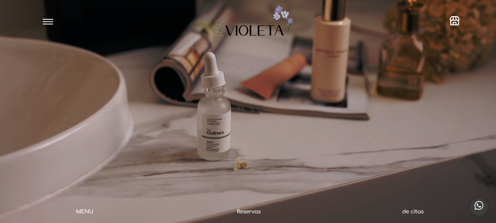
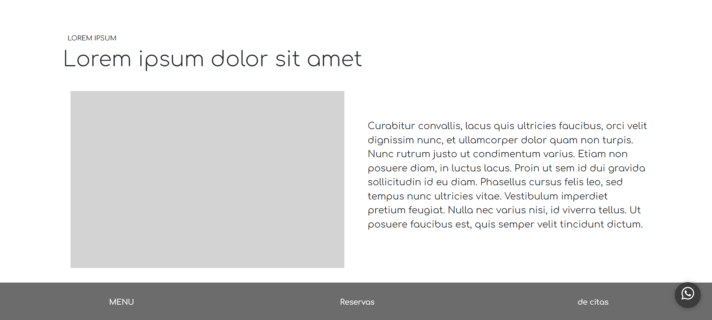
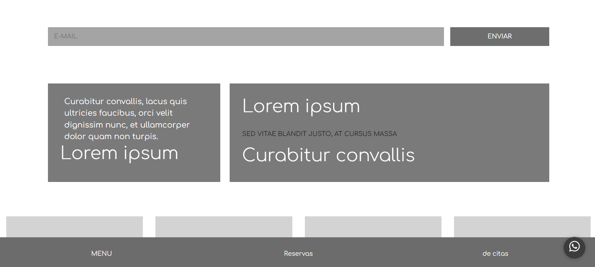

# Proyecto de pagina web para un SPA

Esta página web fue desarrollada durante mi participación en modalidad dual para un spa, originalmente heho para un negocio real dedicado a tratamientos de belleza y bienestar. 

Siguiendo las especificaciones iniciales, el sitio fue creado utilizando HTML, JavaScript, CSS y frameworks como Bootstrap. 

Aunque es una página dinámica e interactiva, esta versión no cuenta con todas las funcionalidades avanzadas. Este proyecto fue una oportunidad para mejorar mis habilidades de desarrollo web, aunque la primera versión fue finalmente descartada y no se utiliza en el sitio oficial del negocio.

[Proyecto Desplegado (https://pagina-spa.vercel.app/)](https://pagina-spa.vercel.app/)

## Vista previa de la pagina

## Tecnologia
* HTML
* CSS
* Bootstrap
* JavaScript

---
Desarrollado con 🤍 por [Karina Escalante](https://www.instagram.com/kary_olmos_22?igsh=aHI4c2hubzB3NXEx)